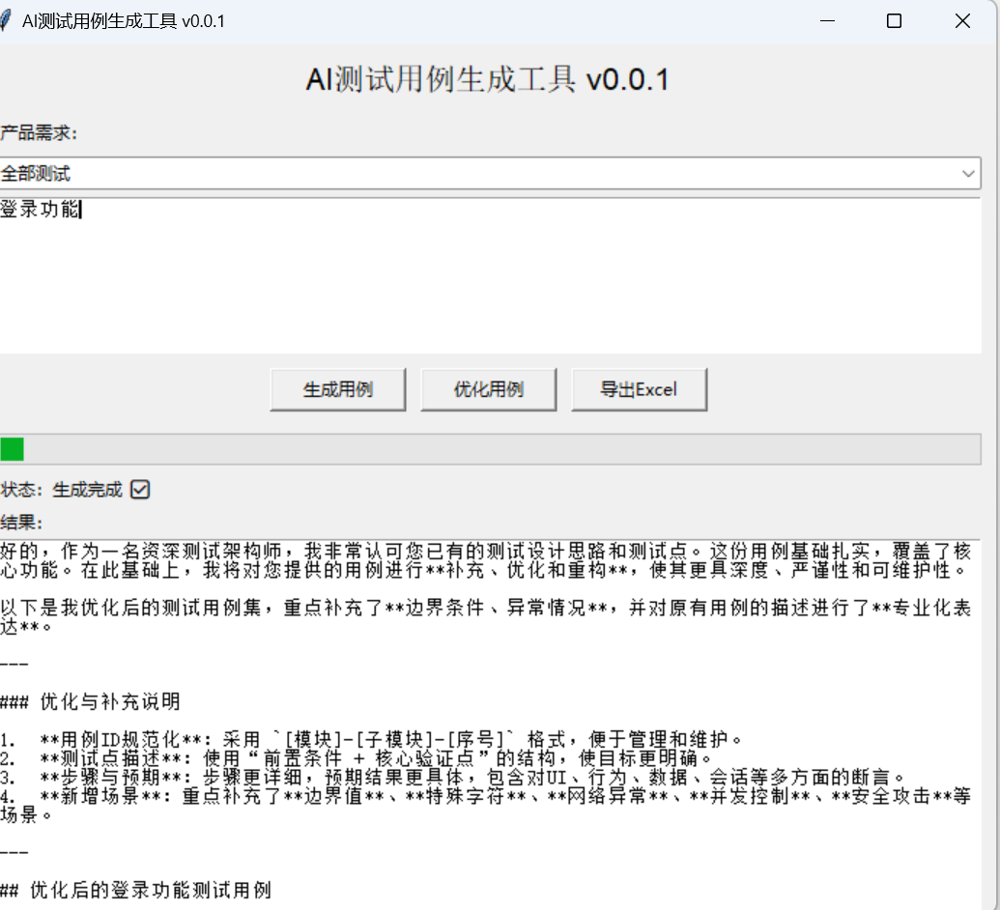
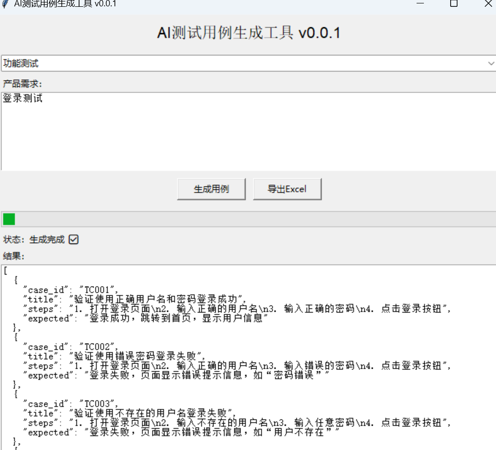
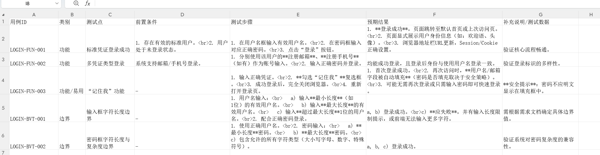
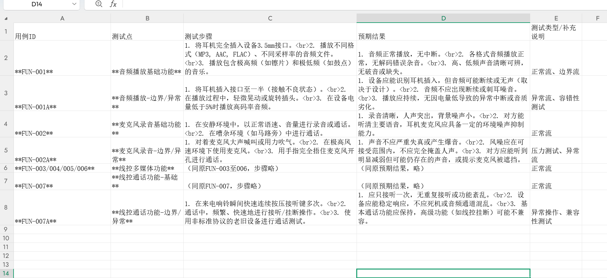
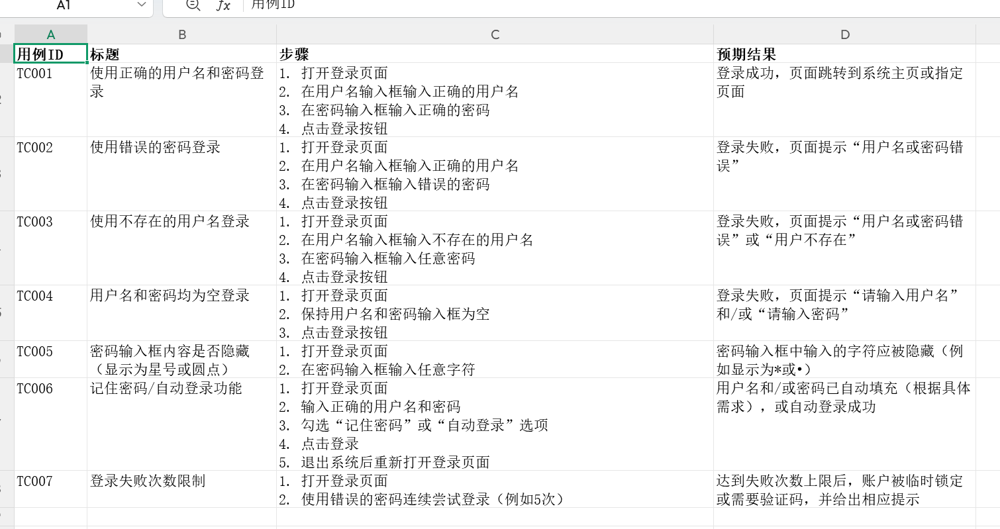
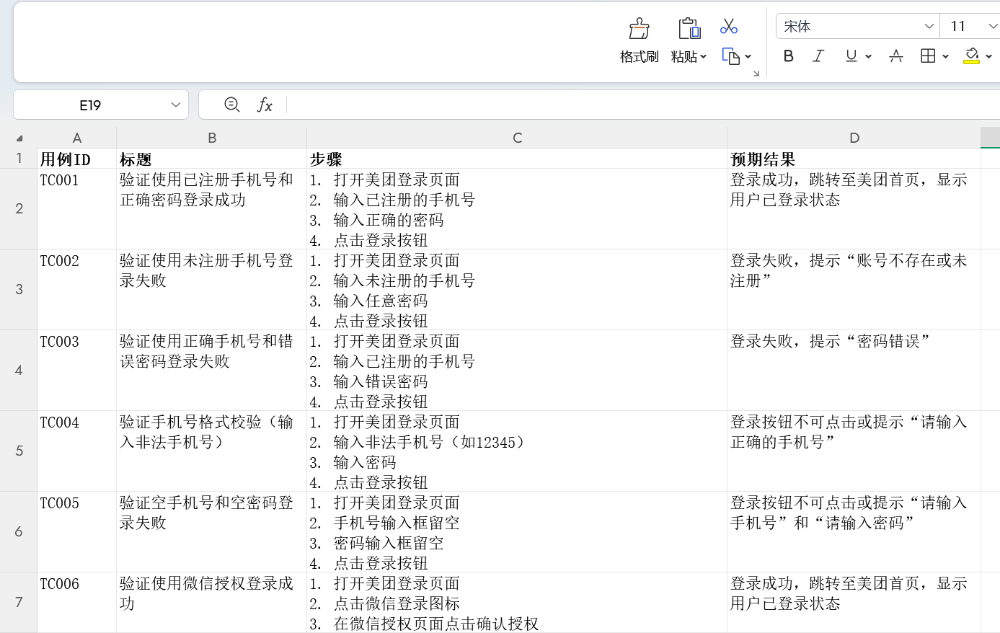

# AI 测试用例生成工具 (AI Test Case Generator)

[](LICENSE)
[](https://python.org)

基于 DeepSeek API 的智能测试用例生成工具，自动化完成测试用例的设计、优化与导出。

## GUI 界面进化

| v0.0.1（初版） | v0.0.4（当前） |
|---|---|
|  |  |

## Excel 导出效果迭代

| 版本 | 效果 |
|---|---|
| v0.0.1 |  |
| v0.0.2 |  |
| v0.0.3 |  |
| v0.0.4 |  |

## 技术亮点

| 维度 | 实现 |
|---|---|
| 架构设计 | GUI / Core / Service / Config 四层分离 |
| 并发处理 | threading + daemon 线程，AI 请求不阻塞 UI |
| API 韧性 | 自动重试 + 4 类异常分级处理（断网/鉴权/限流/未知） |
| 输出解析 | 优先 JSON 结构化解析，兼容 Markdown 表格降级 |
| Excel 自动化 | openpyxl 表头加粗 + 自适应列宽 + 自动换行 |
| 安全实践 | dotenv 管理密钥，禁止硬编码（.env 已 gitignore） |
| 可分发 | PyInstaller 打包单文件 .exe，无需 Python 环境 |

## 快速开始

```bash
git clone https://github.com/kekkeer/testcase-ai.git
cd testcase-ai
pip install -r requirements.txt
# 创建 .env 文件写入 DEEPSEEK_API_KEY=sk-xxx
python gui_app.py
```

## 项目结构

```
├── gui_app.py               # Tkinter 图形界面（主入口）
├── core.py                  # 核心逻辑（AI调用 + Excel导出）
├── config/
│   └── settings.py          # 应用配置（版本号、名称）
├── services/
│   └── deepseek_client.py   # API 客户端（单例 + .env）
├── screenshots/             # 界面截图
├── requirements.txt
├── .env.example             # 密钥配置模板
└── LICENSE                  # MIT 开源协议
```

## 技术栈

Python · Tkinter · DeepSeek API · openpyxl · PyInstaller · python-dotenv
